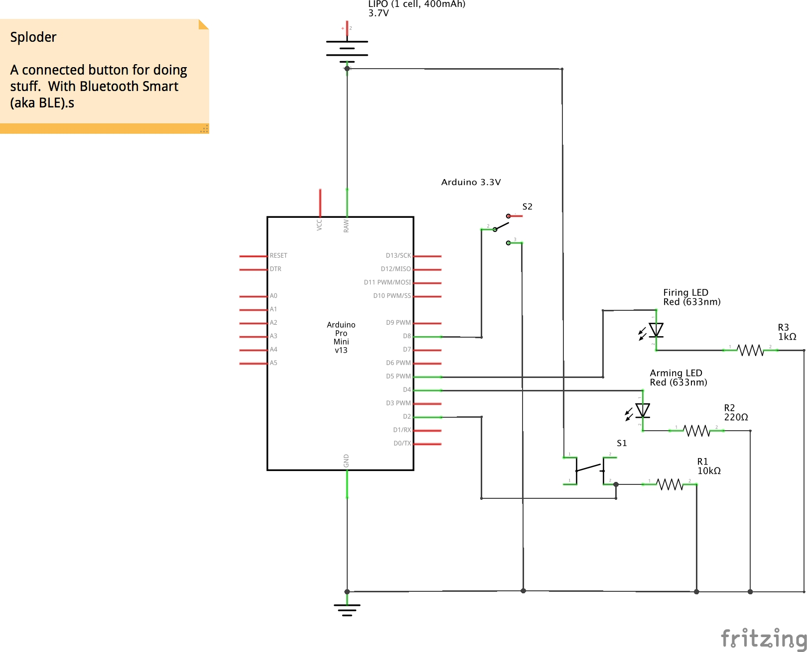

#SPLODER

A connected button for doing stuff up. With Bluetooth Smart (aka BLE).

## Dependencies

* [FiniteStateMachine](http://playground.arduino.cc/Code/FiniteStateMachine)

## Building Sploder

Sploder is currently being developed using [Arduino](http://arduino.cc) 1.0.6, mostly due to incompatibilities between the Arduino 1.5/1.6 branch and the Adafruit BLE libraries.

If you want to hack on Sploder, clone the project into your Arduino sketchbook directory, and make sure you've installed the library dependencies above.

## Design notes

See the Fritzing sketch `sploder.fzz` for details on the Sploder circuit.

I am using an Arduino Pro Mini 3.3V for my Sploder implementation, but any Arduino should work just fine. I am powering my Sploder from a 3.7V LiPO battery, but anything that works from 3.7V-12V will probably work.
