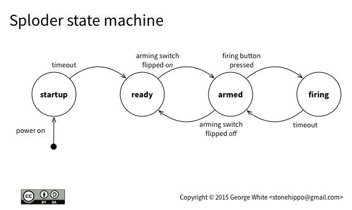

# SPLODER

A connected button for doing stuff. With Bluetooth Smart (aka BLE).

## Dependencies

* Arduino [FiniteStateMachine](http://playground.arduino.cc/Code/FiniteStateMachine) - installed in `/lib`
* [Adafruit's nRF8001 Bluetooth Low Energy Breakout drivers](https://github.com/adafruit/Adafruit_nRF8001)

## What Sploder is and what it does

The first pass design of Sploder is pretty simple. Its a connected Thing, a button that can be used to start some action, somewhere.

By itself, Sploder won't do much, except light up a couple of LEDs. But if a device running the right kind of app is connected to Sploder via Bluetooth LE, that app can monitor the state of Sploder and react in any number of ways: changing it's own state, sending actions to other services, et cetera.

### Sploder's states of mind

Sploder's firmware implements a simple Finite State Machine, an FSM, to make it simple to keep track of what Sploder is doing now (and what it should do next). Sploder has four basic states:

* startup
* ready
* armed
* firing

Sploder's FSM watches for three types of events for each state: entering, updating, or leaving. The events may occur automatically, or based on input to Sploder's sensor, i.e. it's arming or firing switches.

The *startup* state is the initial state when the Sploder device is turned on. Right now, this doesn't do much of anything except pause for a second, then immediate transition to the ready state.

The *ready* state is the default resting state of the Sploder. While in this state, Sploder sits around waiting for someone to flip its arming switch. Until that happens, Sploder is pretty boring.

The *armed* state is entered once the arming switch is flipped. At this point, Sploder will let the world know it's ready to go by lighting its _armed_ LED. And it will start checking to see if the firing button is pressed or if someone has flipped the arming switch off again. The _armed_ LED is disabled whenever this state is left.

The *firing* state occurs when the firing button is pressed while in the armed state. The _firing_ LED is lit for one second, then the state is reverted back to armed.

## Building Sploder

Sploder is currently being developed using [Platform.io](http://platformio.org).

If you want to hack on Sploder, clone the project, and make sure you've installed the library dependencies above.

## Design notes

See the Fritzing sketch for the Sploder circuit is available in `docs`. (Sorry for the outsized nrf on the schematic. Adafruit needs to fix some scale issues on some parts in their still-excellent [Fritzing Library](https://github.com/adafruit/Fritzing-Library)).

I am using an Arduino Pro Mini 3.3V for my Sploder implementation, but any Arduino should work just fine. I am powering my Sploder from a 3.7V LiPO battery, but anything that works from 3.7V-12V will probably work.

The Bluetooth LE interface is provided by Adafruit's nrf8001 Bluefruit LE Breakout. You can check out [the guide for the nrf8001 board](https://learn.adafruit.com/getting-started-with-the-nrf8001-bluefruit-le-breakout/) if you want detailed information on how to use it.

## Code License

The MIT License (MIT)

Copyright (c) [year] [fullname]

Permission is hereby granted, free of charge, to any person obtaining a copy
of this software and associated documentation files (the "Software"), to deal
in the Software without restriction, including without limitation the rights
to use, copy, modify, merge, publish, distribute, sublicense, and/or sell
copies of the Software, and to permit persons to whom the Software is
furnished to do so, subject to the following conditions:

The above copyright notice and this permission notice shall be included in all
copies or substantial portions of the Software.

THE SOFTWARE IS PROVIDED "AS IS", WITHOUT WARRANTY OF ANY KIND, EXPRESS OR
IMPLIED, INCLUDING BUT NOT LIMITED TO THE WARRANTIES OF MERCHANTABILITY,
FITNESS FOR A PARTICULAR PURPOSE AND NONINFRINGEMENT. IN NO EVENT SHALL THE
AUTHORS OR COPYRIGHT HOLDERS BE LIABLE FOR ANY CLAIM, DAMAGES OR OTHER
LIABILITY, WHETHER IN AN ACTION OF CONTRACT, TORT OR OTHERWISE, ARISING FROM,
OUT OF OR IN CONNECTION WITH THE SOFTWARE OR THE USE OR OTHER DEALINGS IN THE
SOFTWARE.

## Documentation License

This work is licensed under the Creative Commons Attribution-ShareAlike 4.0 International License. To view a copy of this license, visit http://creativecommons.org/licenses/by-sa/4.0/.
